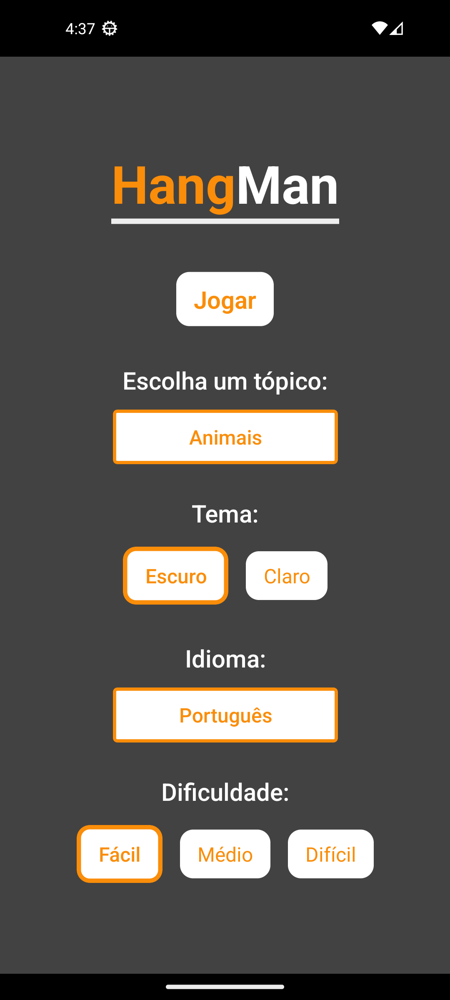
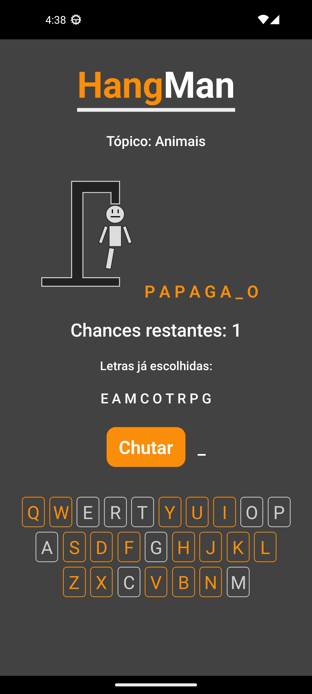
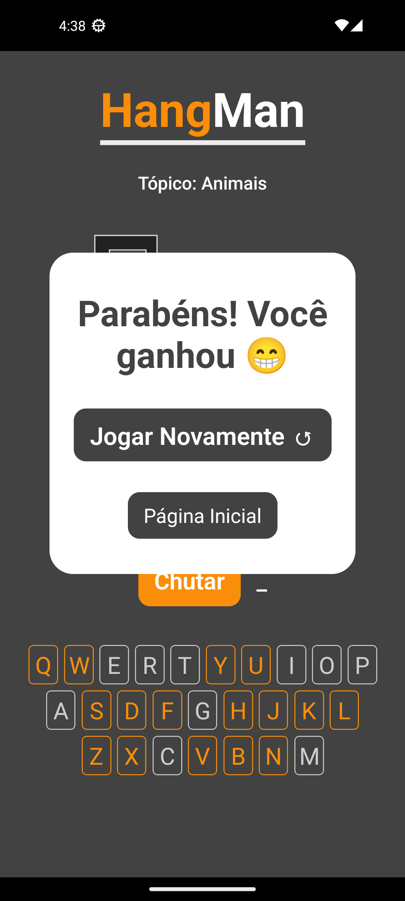

# Hang Man

> Status do Projeto: Concluído

Um simples jogo da forca para praticar desenvolvimento mobile com React Native.

| :placard: Vitrine.Dev |     |
| -------------  | --- |
| :sparkles: Nome | **Hang Man**
| :label: Tecnologias | React Native, JavaScript, Expo


## Detalhes do projeto

O projeto foi desenvolvido em React Native, com auxílio da Context API para gerenciar os estados, React Navigation, Expo e a biblioteca Animatable para animações. A escolha de palavras é feita utilizando web scraping, nos três idiomas disponíveis: português, inglês e espanhol.

---

## Features

### Componentes Animados

Ambas as páginas são animadas quando renderizadas pela primeira vez, outros componentes, como o botão de jogar e o de jogar novamente tem animações infinitas, que incentivam o usuário a clicar neles e jogar mais. O componente de carregando é um caso especial, já que deve ser animado para mostrar que o app ainda está funcionando. Essas animações foram feitas com a biblioteca react-native-animatable, que permite a criação de animações de forma simples.

### Tema claro e escuro

O arquivo estilosGlobais.js contém duas propriedades com as variáveis que têm as cores que serão usadas nos componentes, então usando a context API do React foi possível armazenar o tema atual e recuperar a propriedade com os estilos corretos usando a criação de StyleSheets dinâmicos.

### Múltiplos tópicos

No jogo é possível escolher entre uma variedade de tópicos: 

### Múltiplas línguas

O jogo está disponível em três línguas, para tornar isso possível foi necessário encapsular todos os textos do app no arquivo textos.js, então para adicionar uma nova língua basta adicionar uma nova propriedade nesse arquivo com a tradução dos textos. A context API permite que o idioma atual seja armazenado e então usado como argumento na função getTextos, que vai retornar os textos no idioma certo.

### Opções para dificuldades

Existem três dificuldades: fácil, médio e difícl, cada uma tem um número de erros máximo que vão ser usados na hora do jogo, também influenciam como a representação visual vai progredir conforme erros são cometidos.

### Geração de palavras aleatórias

O site <https://www.palabrasaleatorias.com/> consegue gerar palavras aleatórias em várias línguas, então baseado na língua selecionada, a função escolherPalavraSecreta vai realizar a requisição para o site usando a biblioteca axios. Com a resposta do servidor em mãos nós podemos buscar a palavra no meio do HTML e então retorná-la. Um possível erro seria caso o site em questão ou o usuário estejam offline, contudo nesses casos o jogo continua funcionando normalmente, pois há um arquivo com uma grande lista de palavras em todos os três idiomas, então basta escolher um indíce aleatório do array.

### Jogo da Forca

O jogo funciona baseado em vários React States, com variáveis especiais como a palavra secreta, a letra selecionada com o teclado, uma lista com as letras já selecionadas, o número de erros, o estado atual do jogo (se ganhou, perdeu ou ainda está em andamento), assim como seu progresso atual. Como português e espanhol têm palavras com caracteres especiais, foi fundamental usar uma função de normalização na hora de comparar a palavra secreta com a letra escolhida, somente na hora da comparação, para manter a visualização inalterada. Existe também uma ilustração dinâmica do personagem sendo "enforcado" conforme erros são cometidos usando SVGs, que por não serem suportados nativamente, precisam das bibliotecas react-native-svg e react-native-svg-transformer, assim como configurações extras no arquivo metro.config.js.

## Páginas

### Página Inicial

Contém as opções que podem ser selecionadas:



### Jogo

Contém o jogo em si, com o teclado onde se pode escolher as letras, um botão para chutar, além da imagem mostrando quantos erros já foram cometidos:



### Tela final

Contém a mensagem de vitória ou derrota, dando a opção de voltar à página inicial ou jogar novamente:



---

## Rodando a aplicação

Estando com um emulador ou celular aberto, basta executar os comandos abaixo e em seguida escolher a plataforma pela cli do expo (android, web ou ios).

```sh
git clone https://github.com/BrenoMorim/hangman.git hangman
cd hangman
npm install
npm install -g expo
npm start
```

## Fazendo o build de um arquivo .apk

Tendo uma conta na EAS (expo application service), você pode realizar o build da aplicação de forma gratuita e criar um arquivo .apk para ser instalado em um celular.

```sh
eas login
eas build -p android -e preview
```
